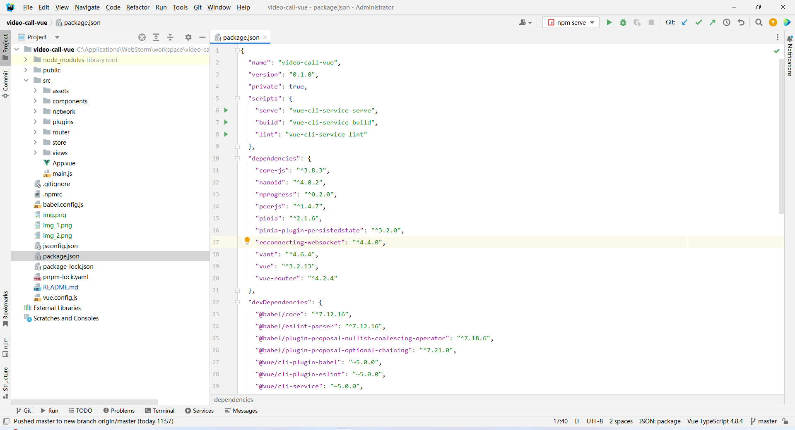
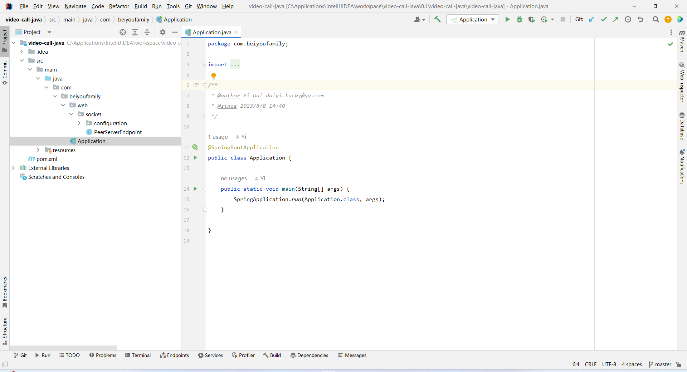
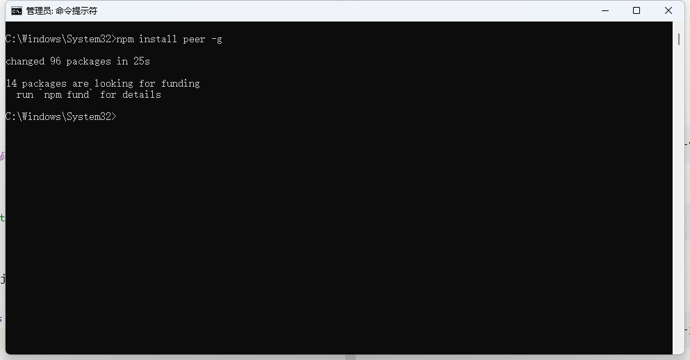
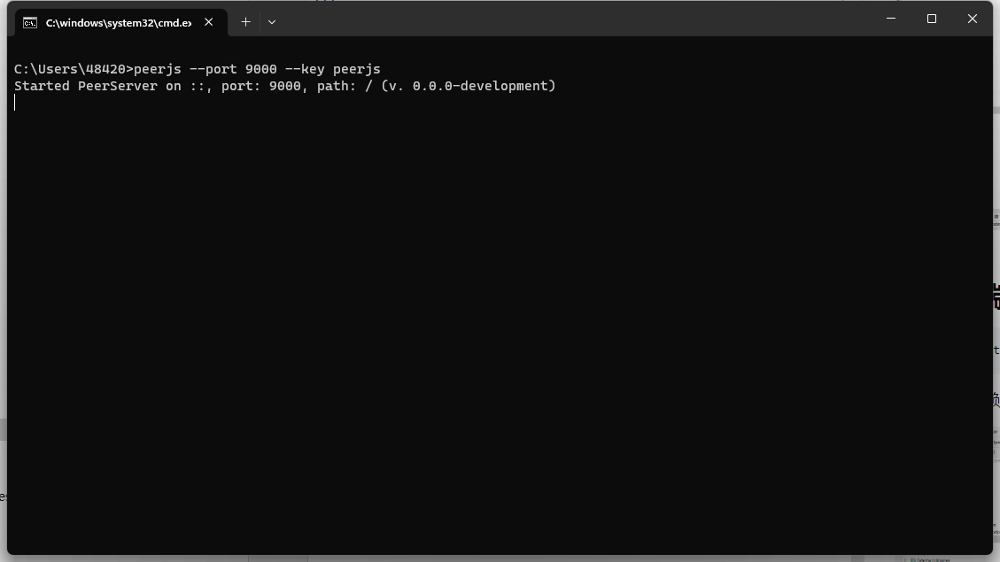
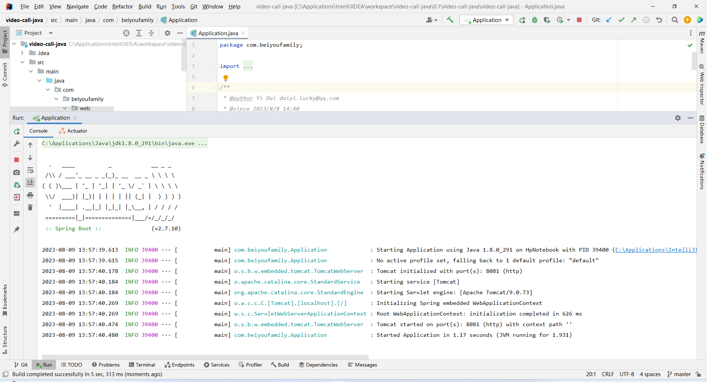
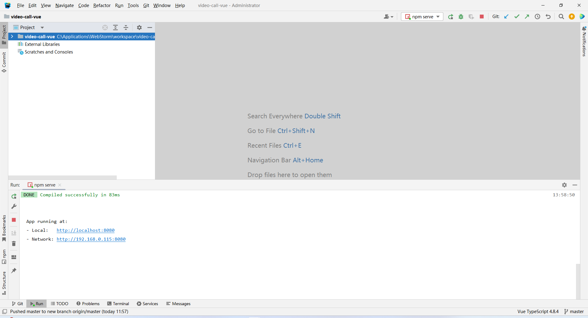
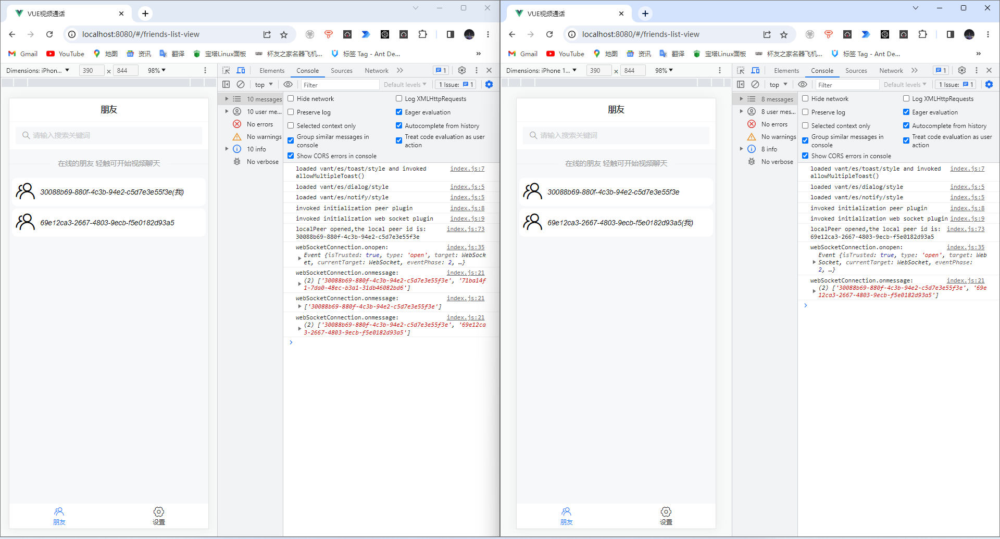
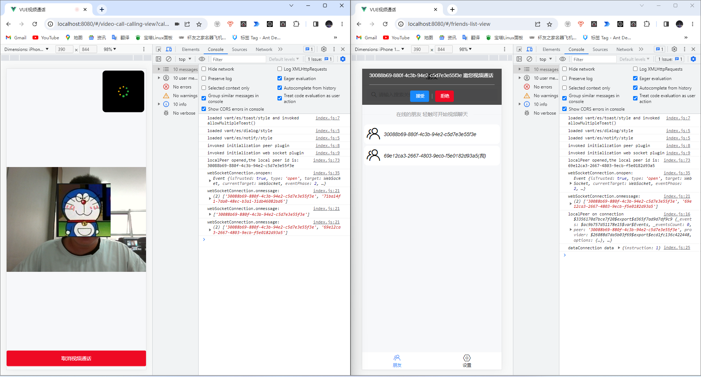
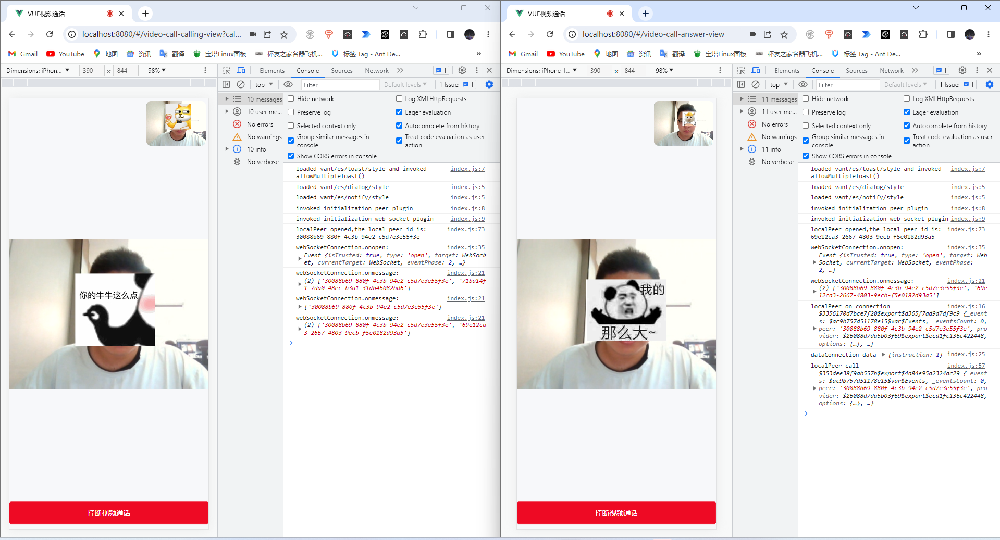

# 关键词

VUE视频通话
VUE3视频通话
Js视频通话
JavaScript视频通话
Web视频通话
网页视频通话
WebRTC视频通话
WebSocket+WebRTC视频通话
---

# 运行环境

## 前端

| 名称      | 版本号        |
|---------|------------|
| 操作系统    | Windows 11 |
| VUE     | 3.2.13     |
| Node js | 18.15.0    |

## 后端

| 名称            | 版本号        |
|---------------|------------|
| 操作系统          | Windows 11 |
| IntelliJ IDEA | 2022.3.3   |
| Java          | 1.8.0_291  |
| Spring Boot   | 2.7.10     |

---

## 安装

## 克隆前端代码到本地并安装依赖

克隆到本地

```
git clone https://gitee.com/daiyi-personal/video-call-vue.git
```

安装依赖

```
npm install
```



## 克隆后端代码到本地并安装依赖

```
git clone https://gitee.com/daiyi-personal/video-call-java.git
```

Maven导入依赖jar包



## 安装Peerjs Server

全局安装peer（管理员模式！！）

```
npm install peer -g
```



# 运行项目

## 运行Peer Server

```
peerjs --port 9000 --key peerjs
```



## 运行Java后台



## 运行前端

```
npm run serve
```



# 测试

由于没有ssl协议，所以只能在localhost环境下测试，
Windows下不同浏览器无法调用同一个摄像头，所以用
谷歌浏览器开两个标签页表示两个客户端。



呼叫


接听


**其他挂断、取消、拒绝通话功能均已实现，可以自行测试**

# 支持

## 联系作者

微信：18380924397

邮箱：daiyi.lucky@gmail.com

## star

您的star是对作者最大的认可

Gitee
前端: [https://gitee.com/daiyi-personal/video-call-vue.git](https://gitee.com/daiyi-personal/video-call-vue.git)

后台: [https://gitee.com/daiyi-personal/video-call-java.git](https://gitee.com/daiyi-personal/video-call-java.git)

---

GitHub
前端: [https://gitee.com/daiyi-personal/video-call-vue.git](https://gitee.com/daiyi-personal/video-call-vue.git)

后台: [https://gitee.com/daiyi-personal/video-call-java.git](https://gitee.com/daiyi-personal/video-call-java.git)

## 打赏

如果您觉得这个demo对您有用；
不如请作者喝一杯可乐，一分两分皆是情，一块两块皆是爱。

---
